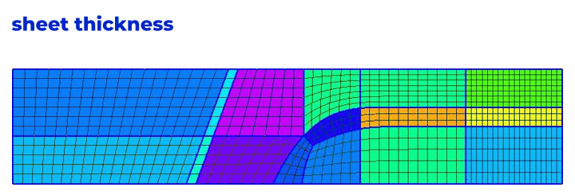

# virtual-spot-weld
Gmsh script for generating finite element meshes of resistance spot welded joints.

The script provides vast flexibility in varying the geometry of the spot weld as well as varying parameters for the mesh generation.

 

# Documentation
[https://pytunia.github.io/virtual-spot-weld/](https://pytunia.github.io/virtual-spot-weld/)

**Under construction**
